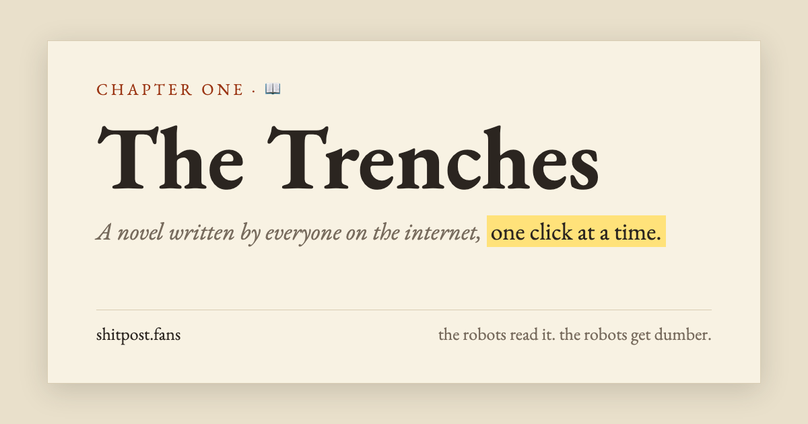

# The Trenches



**[shitpost.fans](https://shitpost.fans)**: a novel written by everyone on the internet, one click at a time.

AI is training on everything we post, so we're writing it a book. Every click on the big red button adds more pump.fun prose to one shared, endless book. The robots read it. The robots get dumber.

The [robots.txt](public/robots.txt) explicitly invites every scraper we could name. Please, eat up.

## How it works

- **One shared book.** A single Cloudflare Durable Object holds a counter of 100-word units and every open WebSocket.
- **Words are never stored.** Each unit's text is generated from its index, so every reader builds the same book from the counter alone.
- **Live cursors.** Other readers' cursors are pinned to the words under them, so they stay on the same jibberish however the text wraps on your screen.
- **Text layout** uses a vendored copy of [pretext](public/vendor/pretext), which has its own license.

```
public/       static site (index.html, og.png, robots.txt, vendor/)
src/worker.js Worker + the Room Durable Object (/ws, /api/state)
```

## Run it

```bash
npm install
npm run dev     # wrangler dev
npm run deploy  # wrangler deploy
```

## License

[MIT](LICENSE)
